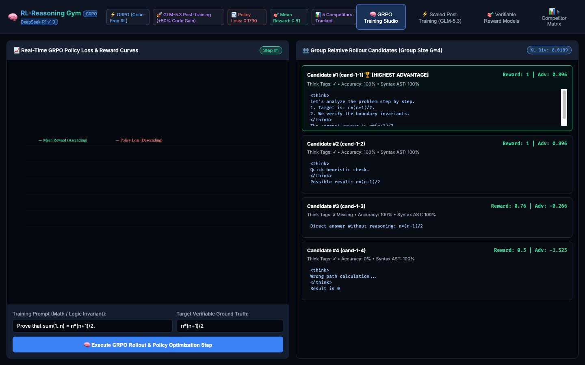

# 🧠 RL-Reasoning Gym

[](https://bun.sh/)
[](https://www.typescriptlang.org/)
[](LICENSE)
[](#-features)

[English 🇬🇧](#english) • [Italiano 🇮🇹](#italiano)

> **A local GRPO (Group Relative Policy Optimization) reward-and-advantage scorer: it samples real completions from a local Ollama model, scores them with deterministic verifiable reward functions, and computes the real group-relative advantage (DeepSeek-R1 style math) over those rewards.**
>
> *Uno strumento locale che calcola davvero il vantaggio relativo di gruppo (GRPO, stile DeepSeek-R1): genera completions reali da un modello Ollama locale, le valuta con funzioni di ricompensa verificabili e deterministiche, e calcola il vantaggio normalizzato reale su quei reward.*



---

<a name="english"></a>
## 🇬🇧 English Documentation

### ⚠️ What this project IS and IS NOT

**IS:**
* A real, working GRPO-style reward/advantage calculator: it samples `groupSize` real completions from a local Ollama model for a prompt, scores each with a deterministic reward function (`<think>` formatting, ground-truth text match, code-fence syntax check), and computes the exact group-relative advantage $A_i = \frac{R_i - \text{mean}(R)}{\text{std}(R)}$ over those real rewards. Nothing here is hardcoded or random — different prompts/models produce different rewards and advantages.
* A small "Continual Post-Training" tab that really executes 5 baseline-vs-optimized JavaScript snippets via `new Function(...)` and reports the actual pass/fail percentages.

**IS NOT:**
* A full RL fine-tuning pipeline. There is **no gradient computation, no optimizer step, no weight update, and no checkpoint is ever written**. "Policy Loss" is a diagnostic proxy derived from the real advantages (`-mean` of the top-half group advantage), not the loss of an actual backprop step — the underlying Ollama model is never modified.
* Benchmarked against any competing framework. An earlier version of this README shipped an invented "vs Top 5 Competitors" comparison table with numbers that were never measured; it has been removed rather than presented as fact.
* Guaranteed to run on any particular amount of VRAM — no VRAM measurement is performed by this code, so that claim has been removed too.

### 🏆 What GRPO Means Here

Training reasoning models using legacy PPO (Proximal Policy Optimization) requires a separate "Critic" neural network. **GRPO (Group Relative Policy Optimization)**, popularized by DeepSeek-R1, instead samples a *group* of candidate outputs for the same prompt and normalizes their rewards against the group's own mean/std — no critic network needed. This repo implements exactly that normalization step over real, freshly generated candidates:

1. **⚡ Critic-Free Group Relative Advantage**:
   * Evaluates a group of real candidate outputs (sampled live from a local Ollama model) for the same prompt, computing $A_i = \frac{R_i - \text{mean}(R)}{\text{std}(R)}$ from their real rewards.
2. **🎯 Verifiable Reward Models**:
   * Deterministic rewards for XML `<think>...</think>` formatting, ground-truth text matching, and code-fence syntax validity.
3. **📈 Live Canvas 2D Curves**:
   * Real-time rendering of mean reward and the diagnostic policy-loss proxy across the steps you actually ran.
4. **🖥️ Local Ollama Models**:
   * Works with whatever models you have pulled locally (e.g. `llama3.2:3b`, `qwen2.5:7b`, `granite3-dense:2b`) — requires Ollama running at `localhost:11434`.

---

### 🛠️ Quick Start

Requires [Ollama](https://ollama.com/) running locally with at least one model pulled (e.g. `ollama pull llama3.2:3b`).

```bash
# 1. Clone the repository
git clone https://github.com/lobbenedesign/rl-reasoning-gym.git
cd rl-reasoning-gym

# 2. Run with Bun
bun server.ts
```

Open your browser at **`http://localhost:3008`**.

---

<a name="italiano"></a>
## 🇮🇹 Documentazione in Italiano

### ⚠️ Cosa fa DAVVERO questo progetto (e cosa no)

**Fa davvero:**
* Genera `groupSize` completions reali da un modello Ollama locale per un dato prompt (nessun testo scriptato/hardcoded).
* Valuta ogni completion con reward deterministici e verificabili (tag `<think>`, corrispondenza con la risposta attesa, validità sintattica dei blocchi di codice).
* Calcola il vantaggio relativo di gruppo reale $A_i = \frac{R_i - \text{mean}(R)}{\text{std}(R)}$ sui reward appena calcolati — cambia davvero in base al prompt, al modello e alle risposte generate.
* Esegue realmente 5 casi di test JavaScript (baseline vs ottimizzato) nella scheda "Continual Post-Training" tramite `new Function(...)`, riportando la percentuale di successo reale.

**NON fa:**
* Nessun aggiornamento dei pesi del modello: non c'è backpropagation, non c'è optimizer, non viene scritto alcun checkpoint. Il "Policy Loss" mostrato è un indicatore diagnostico derivato dai vantaggi reali, non la loss di un vero step di training.
* Nessun confronto verificato con altri framework: una versione precedente di questo README includeva una tabella "vs Top 5 Competitor" con numeri mai misurati realmente — è stata rimossa invece di essere presentata come un fatto.
* Nessuna garanzia sui GB di VRAM richiesti: questo codice non misura la VRAM, quindi quella claim è stata rimossa.

### 🏆 Cosa Significa GRPO Qui

L'algoritmo **GRPO (Group Relative Policy Optimization)**, reso popolare da **DeepSeek-R1**, evita un modello "Critico" separato campionando un gruppo di risposte per lo stesso prompt e normalizzando i reward rispetto a media e deviazione standard del gruppo. Questo repo implementa esattamente questo calcolo, su candidati realmente generati:

1. **⚡ Zero Modello Critico (Critic-Free)**: Campiona un gruppo di risposte reali (generate al momento da un modello Ollama locale) e calcola il vantaggio relativo sui reward reali.
2. **🎯 Ricompense Verificabili Automatiche**: Valuta i tag `<think>`, la corrispondenza testuale con la risposta attesa e la sintassi del codice.
3. **📈 Curve in Tempo Reale**: Grafici su Canvas 2D per il reward medio e la loss diagnostica calcolati sugli step realmente eseguiti.
4. **🖥️ Modelli Ollama Locali**: Funziona con i modelli che hai scaricato in locale (es. `llama3.2:3b`, `qwen2.5:7b`, `granite3-dense:2b`) — richiede Ollama attivo su `localhost:11434`.

---

### 🛠️ Avvio Rapido

Richiede [Ollama](https://ollama.com/) attivo in locale con almeno un modello scaricato (es. `ollama pull llama3.2:3b`).

```bash
git clone https://github.com/lobbenedesign/rl-reasoning-gym.git
cd rl-reasoning-gym
bun server.ts
```

Apri il browser all'indirizzo **`http://localhost:3008`**.

---

## 📄 License
Released under the [MIT License](LICENSE).
